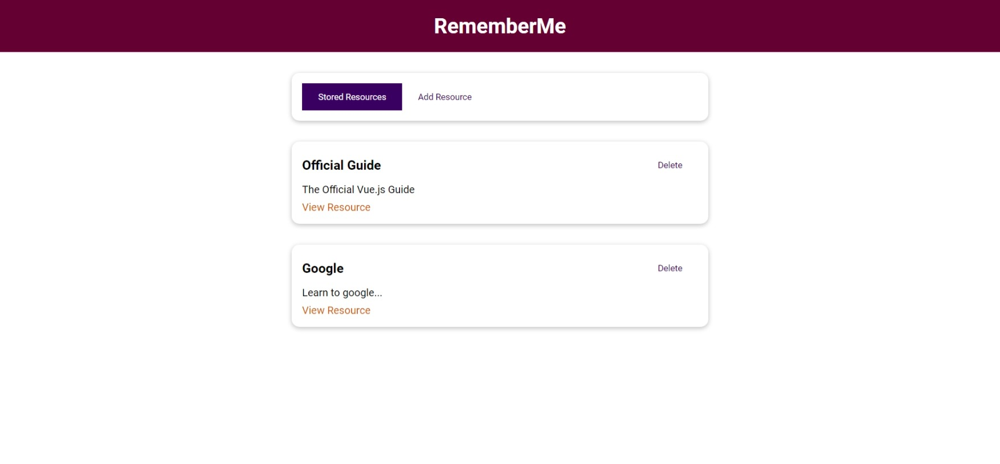
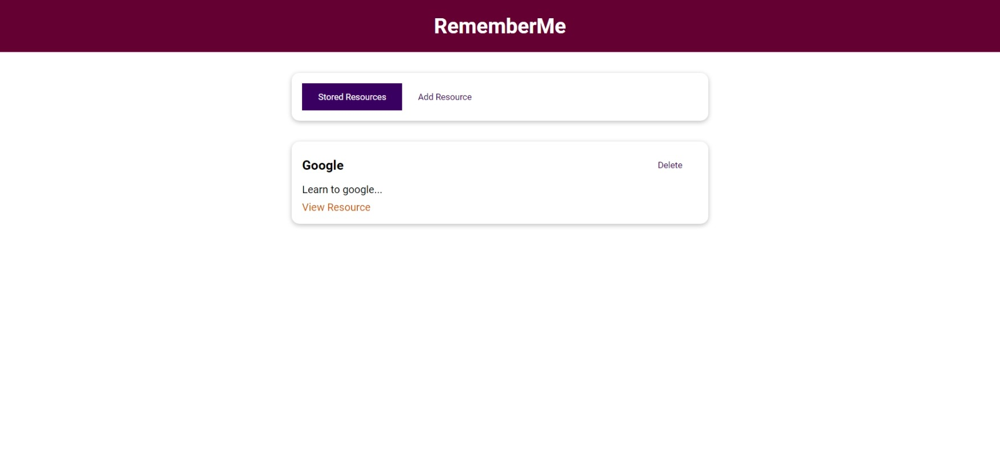
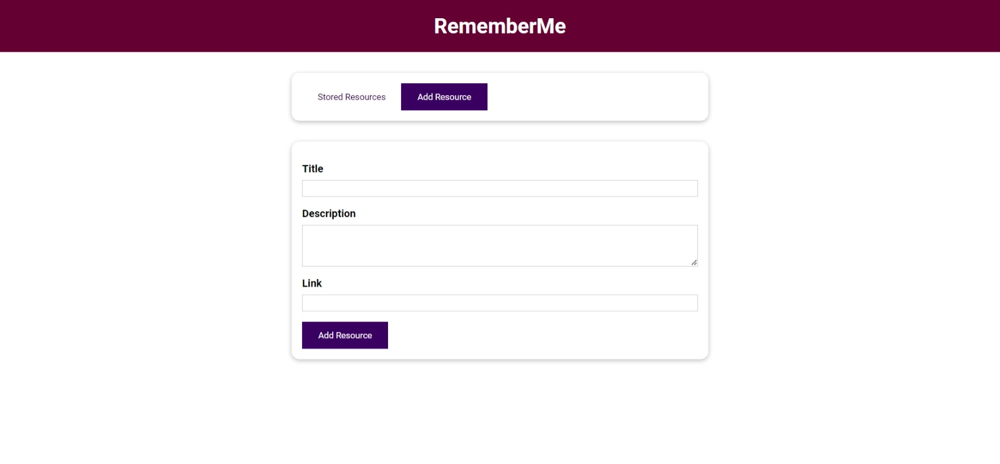

    <h1 align='center'><i>Learning resources</i></h1>
    
 Remember your learning resources  

<h2 style="display:inline">📝 Table of Contents</h2>

- 📑 About
- ⛏️ Built With
- 📷 Screenshots
- ✍️ Contributors
- 🔒 License

## 📑 About

- Learning resources is a website that allows the user to remember his learning resources. The website is built using Vue js.

## ⛏️ Built With

- Vue js

## 📷 Screenshots

### Resources

### Delete resource

### Add resource

## ✍️ Contributors

<table>
  <tr>

<td align="center">
<a href="https://github.com/Abd-ELrahmanHamza" target="_black">
 <b>Abdelrahman Hamza</b></a> 
</td>

</tr>
 </table>

## 🔒 License 

> This software is licensed under MIT License, See [License](https://github.com/CMP24-SWE-TEAM3/Front-End/blob/main/LICENSE) .
